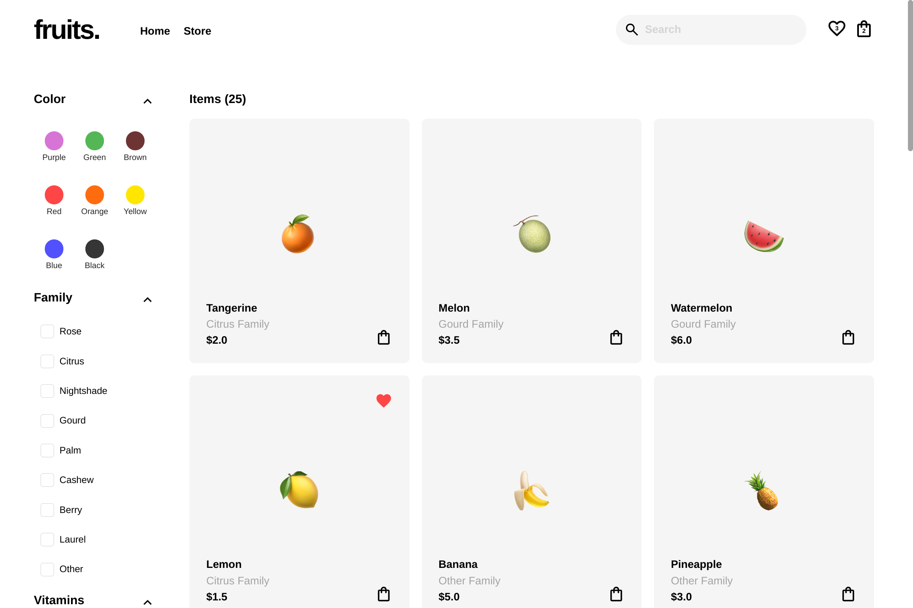

# Fruits Store

Fruits e-commerce store frontend.

## Demo

<p align="center">
  
</p>
<p align="center">
  
</p>
<h2 align="center">
  <a href="https://amadeuio.github.io/fruits-store">👉 Demo</a>
</h2>

## Features

**Friendly UI**

- Simple and intuitive UI
- Smooth animations and feedback
- Performant: mainly animates opacity and transform, minimizing browser repaints
- Responsive
- Minimalistic design, inspired by Nike and Apple
- Fruit emojis are awesome

**Store Features**

- Filter fruits by categories (see [Fruit Filtering](#fruit-filtering))
- Add fruits to bag or favorites
- Hover on bag for a preview of its contents

**Pages**

- Home, Store, Bag and Product pages
- Home page has a carousel previewing featured items

**Customization**

- Products and filters in the store are data-based, allowing for customization with minimal code changes

## Fruit Filtering

Filters are used to narrow down the fruits on screen.

- Filter the fruits by colors, family, vitamins, favorites or a search query
- Multiple filters can be combined
- Results update in real-time

#### Search Query

- Use it to search a fruit using text, it works with name, colors, family or vitamins
- Case, spaces and symbols insensitive
- Try these examples:
  - Searching `um` yields Cucumber, Pumpkin
  - Searching `b6` yields Banana, Pineapple, Cocounut (i.e. fruits with Vitamin B6)
  - Searching `pepper` and selecting the `Red` checkbox yields Hot Pepper (example of filters combined)

## Tech Stack

- **UI Library:** React
- **Languages:** TypeScript, CSS, HTML
- **Build Tool:** Vite
- **Dependencies:**
  - react-burger-menu: Expandable burger menu for mobile
  - react-flip-toolkit: Transition effect when fruits re-arrange
  - react-router-dom: Routing
  - react-slick: Home page carousel
  - react-tooltip: Bag tooltip
  - uuid: Unique ID's

## Main Directories

Located in `src`:

- `components`: React components and its CSS modules
- `data`: Storage of initial data and its type definitions
- `utils`: Utility functions used multiple times throughout the app
- `css`: Global CSS styles
- `Context.tsx`: Context API provider component
- `Router.tsx`: React router provider component
- `main.tsx`: Entry point for the React app

Located in the root:

- `public`: Fruit emoji images and app screenshots

## Data & Functionality

The app uses the following state data. It's shared throughout the whole app using Context API.

#### 1. Fruits Array (initialized in [`fruits.ts`](/src/data/fruits.ts))

Represents all the fruits in the store, contains fruit objects. Example:

```js
{
  id: uuidv4(),
  name: "Blueberries",
  slug: "blueberries",
  price: 4.5,
  quantity: 1,
  colors: ["Blue", "Black"],
  family: "Berry",
  vitamins: ["Vitamin C", "Vitamin K"],
  isFavorite: false,
  inBag: true,
},
// etc...

```

#### 2. Filters Object (initialized in [`filters.ts`](/src/data/filters.ts))

Represents all the filters and their active or inactive state. Example:

```js
{
  colors: [
    { name: "Purple", isChecked: false },
    { name: "Green", isChecked: false },
    // ...etc
  ],
  families: [
    { name: "Rose", isChecked: false },
    { name: "Citrus", isChecked: true },
    // ...etc
  ],
  vitamins: [
    { name: "Vitamin C", isChecked: false },
    { name: "Vitamin A", isChecked: false },
    // ...etc
  ],
  favorite: false,
  query: "tangeri",
}
```

#### How does the filtering functionality work?

The [`filterFruits`](src/utils/filterFruits.ts) function is the key to this functionality. It takes both `fruits` and `filters` and returns an array of the fruits that match the filters.

The [`fruitSection`](src/components/FruitSection/FruitSection.tsx) component is rendering this array, showing only the matching fruits on screen.

Because `fruits` and `filters` are state variables, a re-render is triggered everytime they change and `filterFruits` is re-called, ensuring the shown fruits are always up-to date with the the filters. This method also promotes modularity and readability.

## Run Locally

Clone the project

```bash
git clone https://github.com/amadeuio/fruits-store
```

Go to the project directory

```bash
cd fruits-store
```

Install dependencies

```bash
npm install
```

Start the server

```bash
npm run dev
```

## Acknowledgements

- [Apple Fruit Emojis](https://emojipedia.org/apple)
- [Google Icons](https://fonts.google.com/icons)
- [GPT](https://chat.openai.com)
- [shields.io](https://shields.io)
- [readme.so](https://readme.so)

## License

[MIT](https://choosealicense.com/licenses/mit/)
