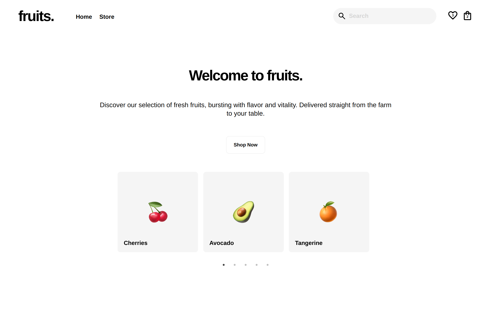

# Fruits Store

Frontend based fruits e-commerce store with React.

## Demo

<p align="center">
  
</p>
<p align="center">
  
</p>
<h2 align="center">
  <a href="https://amadeuio.github.io/fruits-store">👉 Demo</a>
</h2>

## About

The app features the standard e-commerce store features and uses fruits as example products (with fun fruit emojis). Users can easily browse, search, view detailed product info, add products to bag or favorites, and visit the bag to simulate a mock checkout process. The app focuses on simplicity and user-friendliness.

## Features

- Home, Store, Bag and Product pages
- Filter fruits by categories or search (see [Fruit Filtering](#fruit-filtering))
- Add to bag or favorites
- Hover on bag for a preview of its contents
- Feedback, minimalistic design and smooth animations
- Performant: mainly animates opacity and transform, minimizing browser repaints
- Home page carousel previewing featured items
- Responsive
- Products and filters in the store are data-based, allowing for customization with minimal code changes

## Fruit Filtering

Filters narrow down the displayed fruits.

- Filter the fruits by colors, family, vitamins, favorites or a search query
- Multiple filters can be combined
- Active filter tags
- Results update in real-time

#### Search Query

- Use it to search a fruit using text, it works with name, colors, family or vitamins
- Case, spaces and symbols insensitive
- Try these examples:
  - Searching `um` yields Cucumber, Pumpkin
  - Searching `b6` yields Banana, Pineapple, Cocounut (i.e. fruits with Vitamin B6)
  - Searching `pepper` and selecting the `Red` checkbox yields Hot Pepper (example of filters combined)

## Tech Stack

- **UI Library:** React
- **Languages:** TypeScript, CSS, HTML
- **Build Tool:** Vite
- **Dependencies:**
  - react-burger-menu: Expandable burger menu for mobile
  - react-flip-toolkit: Transition effect when fruits re-arrange
  - react-router-dom: Routing
  - react-slick: Home page carousel
  - react-tooltip: Bag tooltip
  - uuid: Unique ID's

## Main Directories

Located in `src`:

- `components`: React components and their CSS modules
- `data`: Storage of initial fruit and filter data and its type definitions
- `utils`: Utility functions used multiple times throughout the app
- `css`: Global CSS styles
- `Context.tsx`: Context API provider component
- `Router.tsx`: React router provider component
- `main.tsx`: Entry point for the React app

Located in the root:

- `public`: Fruit emoji images and app screenshots
- `index.html`: Entry point for the app

## Data & Functionality

The following state data is used to manage the fruits and filters of the store. It's shared throughout the whole app using Context API.

#### 1. Fruits Array (initialized in [`fruits.ts`](/src/data/fruits.ts))

Represents all the fruits in the store, contains fruit objects. Example:

```js
{
  id: uuidv4(),
  name: "Blueberries",
  slug: "blueberries",
  price: 4.5,
  quantity: 1,
  colors: ["Blue", "Black"],
  family: "Berry",
  vitamins: ["Vitamin C", "Vitamin K"],
  isFavorite: false,
  inBag: true,
},
// etc...

```

#### 2. Filters Object (initialized in [`filters.ts`](/src/data/filters.ts))

Represents all the filters and their active or inactive state. Example:

```js
{
  colors: [
    { name: "Purple", isChecked: false },
    { name: "Green", isChecked: false },
    // ...etc
  ],
  families: [
    { name: "Rose", isChecked: false },
    { name: "Citrus", isChecked: true },
    // ...etc
  ],
  vitamins: [
    { name: "Vitamin C", isChecked: false },
    { name: "Vitamin A", isChecked: false },
    // ...etc
  ],
  favorite: false,
  query: "tangeri",
}
```

#### How does the filtering functionality work?

The [`filterFruits`](src/utils/filterFruits.ts) function is the key to this functionality. It takes both `fruits` and `filters` and returns an array of the fruits that match the filters.

The [`fruitSection`](src/components/FruitSection/FruitSection.tsx) component is rendering this resulting array, effectively showing only the matching fruits on screen.

Because `fruits` and `filters` are state variables, a re-render is triggered everytime they change and `filterFruits` is re-called, ensuring the shown fruits are always up-to date with the the filters.

## Run Locally

Clone the project

```bash
git clone https://github.com/amadeuio/fruits-store
```

Go to the project directory

```bash
cd fruits-store
```

Install dependencies

```bash
npm install
```

Start the server

```bash
npm run dev
```

## Acknowledgements

- Design inspo: Nike and Apple
- [Apple Fruit Emojis](https://emojipedia.org/apple)
- [Google Icons](https://fonts.google.com/icons)
- [GPT](https://chat.openai.com)
- [shields.io](https://shields.io)
- [readme.so](https://readme.so)

## License

[MIT](https://choosealicense.com/licenses/mit/)
